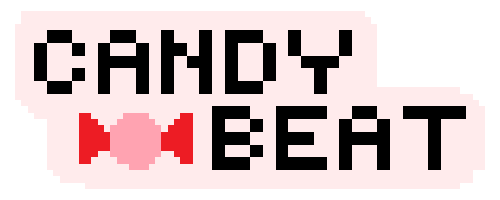

# CandyBeat

  
  <h3>An Irresistibly Sweet Rhythm Game</h3>
  
CandyBeat is a simple, browser-based rhythm game. The objective is to hit the notes (candies) in time with the rhythm as they scroll across the screen.

  
  <a href="https://candy-beat.vercel.app/">View Demo</a> 

## How to Play

1.  **Start the Game**: Open the `index.html` file in your web browser.
2.  **Select Difficulty**: Choose from three difficulty levels: Easy, Medium, or Hard. This choice determines the speed and length of the song.
3.  **Review Instructions**: After selecting a difficulty, you will be taken to an instructions page.
4.  **Begin Gameplay**: Click "Play Game" to start.
5.  **Hit the Notes**: Candies will begin moving from the right side of the screen towards a target circle on the left. Press any key on your keyboard when a candy is inside the target circle to score a point. A successful hit will play a "beep" sound.
6.  **View Results**: Once the level is complete, a modal will appear displaying your final score and accuracy percentage. You can then choose to return to the home screen to play again.

## Features

-   **Dynamic Rhythm Generation**: Each game session features a randomly generated rhythm pattern.
-   **Three Difficulty Levels**:
    -   **Easy**: Slower pace with 30 notes.
    -   **Medium**: Moderate pace with 40 notes.
    -   **Hard**: Fast-paced with 50 notes.
-   **Scoring System**: Tracks your score and calculates your final accuracy.
-   **Web-Based**: No installation required. Play directly in your browser.

## Project Structure

The repository contains the following files to run the game:

-   `index.html`: The main start screen where players select the game difficulty.
-   `instructions.html`: A page that displays the game instructions before starting.
-   `rhythmGame.html`: The main gameplay screen where the rhythm game is played.
-   `rg.js`: The core JavaScript file that handles all game logic, including:
    -   Rhythm array generation (`generateArray`).
    -   Game state management and timing (`main`, `checkArray`).
    -   User input and scoring (`earnPoints`).
    -   DOM manipulation for creating and removing game elements.
-   `rg.css`: The stylesheet that defines the visual appearance, layout, and animations for all pages.
-   `beep.m4a`: The audio file for the sound effect played upon a successful note hit.

**Note:** The HTML and CSS files reference several image assets (`.png`, `.gif`) which are required for the UI to display correctly. Ensure these are present in the root directory when running the project.
